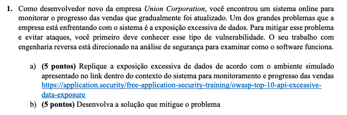

# OTES12 - P2 

## Enunciado



## Instruções de execução: [aplicação cliente](https://github.com/nataliaspeck/otes12-p2/tree/main/client)

A aplicação cliente é o próprio sistema da Union Corporation que foi desenvolvido na prova 1 de OTES12 ([repositório do código prova 1](https://github.com/nataliaspeck/otes12-prova1)) porém, foram realizadas alterações para poder replicar a vulnerabilidade de exposição excessiva de dados. Agora, a aplição cliente da Union Corporation se comunicará via HTTP com um servidor criado para buscar os dados de funcionários como nome e região para realizar o cálculo das cotas (tudo isto está explicado mais detalhadamente no vídeo).

A aplicação cliente está no path `/client` e para rodar é necessário ter o Java 11 instalado em sua máquina ([https://www.oracle.com/java/technologies/javase-jdk11-downloads.html](https://www.oracle.com/java/technologies/javase-jdk11-downloads.html)) e também o gerenciador de pacotes Maven instalado e configurado em sua máquina (https://maven.apache.org/download.cgi).

Ao entrar no diretório `/client` você pode executar o comando `./mvnw spring-boot:run` ou  `java -jar target/otes12-0.0.1-SNAPSHOT-jar-with-dependencies.jar` para executar a aplicação.

Obs: a aplicação cliente só funcionará corretamente caso o servidor esteja em execução também, pois necessita se comunicar com ele para buscar os dados dos funcionários da UnionCorporation.

## Instruções de execução: [aplicação servidor](https://github.com/nataliaspeck/otes12-p2/tree/main/server)

A aplicação servidor foi criada especialmente para a prova e é um servidor em Node.js que sobe no seu localhost na porta 8000, expondo uma API com um endpoint `/employee?userId={userId}` que pode ser consumida por meio de requisições HTTP, neste caso, pela aplicação cliente. Para executar, é necessário ter o Node.js instalado em sua máquina (https://nodejs.org/en/download/) [utilizei a versão v10.18.0] {a versão já deve incluir o gerenciador de pacote `npm` na instalação}.

Basta entrar no diretório `/server` e executar alguns comandos:

```
npm install faker
npm install crypto
node server.js
```

A seguinte mensagem deve aparecer indicando que o servidor subiu com sucesso: `Server running at http://127.0.0.1:8000/employee`

Mais informações sobre o desenvolvimento estão todas no vídeo :)
